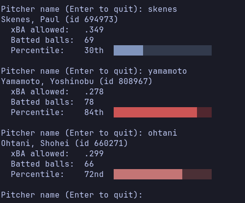

# baseball-xba

A C++17 command-line tool that estimates each MLB pitcher's **expected batting
average allowed (xBA)** from the physics of the balls hit against them, and
ranks every pitcher against the rest of the league as a percentile, shown as a
colored bar, in the spirit of [Baseball Savant](https://baseballsavant.mlb.com/).



Type a name, get a card. If several pitchers match (like `smith`), the program
shows a numbered list to pick from. *(Numbers are from one month of data, June
2026, so small samples move a lot.)*

## What is xBA?

Batting average allowed says what *did* happen: how many balls in play fell for
hits. It also includes luck: a line drive hit right at a fielder is an out, and
a weak blooper that drops in is a hit.

**Expected** batting average asks what *should* have happened, based only on
how the ball was hit:

- **Exit velocity**: how fast the ball left the bat (mph)
- **Launch angle**: how steeply it left the bat (degrees)

A 105 mph line drive is usually a hit, wherever it goes. A 70 mph pop-up
usually isn't. For a pitcher, a low xBA allowed means hitters aren't making
dangerous contact against them.

## How it works

```
pybaseball (Python)  →  CSV  →  load  →  bucket model  →  per-pitcher xBA  →  percentiles  →  search
```

1. **Data pull** (`scripts/pull_statcast.py`): downloads league-wide Statcast
   data with [pybaseball](https://github.com/jldbc/pybaseball), keeping only
   balls in play (~20K rows for one month).
2. **Load** (`batted_ball.cpp`): reads the CSV with the header-only
   [rapidcsv](https://github.com/d99kris/rapidcsv) library.
3. **Bucket model** (`bucket_model.cpp`): groups every batted ball in the
   league into a 5 mph × 5° bucket and records what fraction became hits. That
   fraction is the hit probability for any ball hit that way.
4. **Per-pitcher xBA** (`pitcher_xba.cpp`): averages the hit probability of
   every ball hit against each pitcher.
5. **Percentiles** (`pitcher_xba.cpp`): ranks pitchers with at least 20 batted
   balls, flipped so a *low* xBA allowed (good pitching) gets a *high*
   percentile, like Baseball Savant.
6. **Search** (`search_menu.cpp`): ignores case and accents and matches words
   in any order (`sanchez` finds `Sánchez`, `dylan smith` finds `Smith, Dylan`).

All the math runs once at startup, so every search after that is instant.

## Design

- **Logic and interface are kept apart.** Everything that calculates or
  searches is built as a library, `xba_core`, with no input or output in it.
  The interactive program is a thin layer on top, so a graphical version could
  reuse `xba_core` without changing it.
- **The library is unit tested.** 54 [Catch2](https://github.com/catchorg/Catch2)
  tests, run with CTest, covering edge cases such as negative launch angles,
  percentile ties, and accented names.
- **Dependencies are kept small.** rapidcsv is a single header in `include/`,
  and CMake downloads Catch2 itself with `FetchContent`, so there's no package
  manager to set up.

## Building and running

**Requirements:** a C++17 compiler (GCC or Clang), CMake 3.16+, and Python 3
(only for downloading the data).

**1. Download the data** (the CSV isn't committed; the script rebuilds it):

```bash
python3 -m venv venv
source venv/bin/activate
pip install -r scripts/requirements.txt
python scripts/pull_statcast.py
```

This writes `data/statcast_june2026.csv`. To use a different date range, change
`START_DATE`/`END_DATE` at the top of the script.

**2. Build:**

```bash
cmake -S . -B build
cmake --build build
```

**3. Run** (from inside `build/`, since the program looks for `../data/`):

```bash
cd build
./baseball_xba
```

Type a pitcher's name, or press Enter on an empty line to quit.

**4. Run the tests:**

```bash
ctest --test-dir build
```

## Limitations

- **One month of data.** Good for fast development, but a pitcher with 30
  batted balls can move a lot from one good or bad week.
- **A simple model.** Fixed-size buckets are easy to explain and test, but
  Statcast's own xBA uses a more advanced model, and buckets at the extremes
  have few balls in them, so their hit rates are noisy.
- **Balls in play only.** Strikeouts and walks don't produce a batted ball, so
  this measures the quality of contact allowed, not a pitcher's overall
  results.

## Data

Statcast data from [Baseball Savant](https://baseballsavant.mlb.com/), downloaded
with [pybaseball](https://github.com/jldbc/pybaseball).
